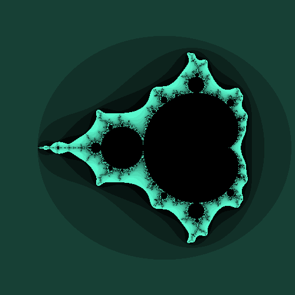

# fractal-generator

This is a command-line tool for creating pictures of fractals.

### setting up and running
You have to have python v3.6.8+ installed beforehand.
It would also be nice to have virtualenv installed as well, but it's not necessary.

Create env and install requirements:
```
python3 -m virtualenv -p $(which python3) env/
source env/bin/activate
pip install -r requirements.txt
```

### usage

You are welcome to play around with the parameters and see where it leads you.
Try out this examples to get an idea about how different parameters would affect the mandelbrot fractal:

```
python fractal_generator.py -f mandelbrot  -a 500 -b 500 -x -4 -y 0 -z 14.0 -p 2 -c \#e5884f -o my_mandelbrot.png
```


```
python fractal_generator.py -f mandelbrot  -a 500 -b 500 -x -9 -y -7 -z 20.0 -p 2 -c \#f025aa -o my_mandelbrot.png
```


```
python fractal_generator.py -f mandelbrot  -a 500 -b 500 -x -4 -y 0 -z 14.0 -p 2.5 -c \#bb9e9a -o my_mandelbrot.png
python fractal_generator.py -f mandelbrot  -a 500 -b 500 -x 0 -y 0 -z 14.0 -p 5.75 -c \#14884f -o my_mandelbrot.png
```


_made by @akorunska with love_